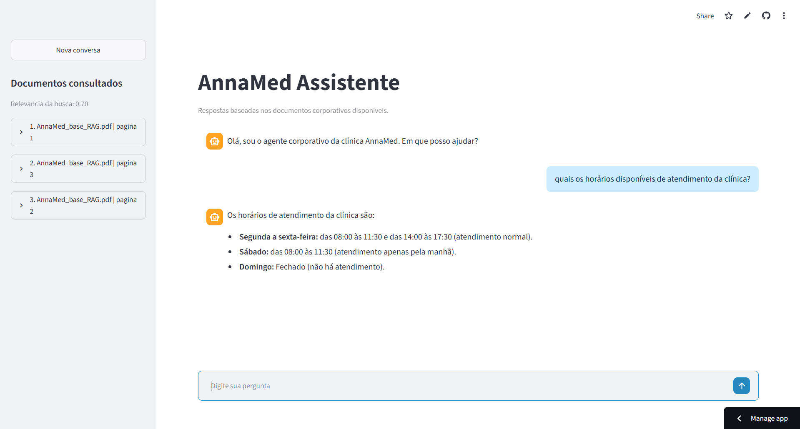
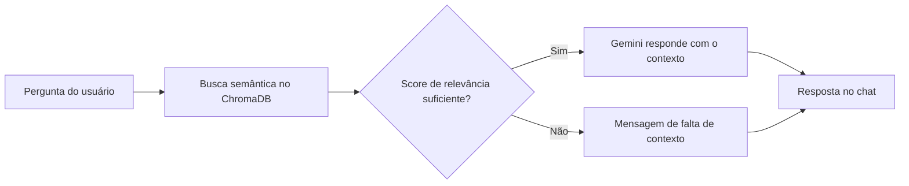

# AnnaMed Assistente Virtual

Assistente virtual de IA para a clínica **AnnaMed**, desenvolvido para o challenge da Alura. A aplicação utiliza RAG (Retrieval-Augmented Generation) para responder perguntas com base exclusivamente nos documentos corporativos fornecidos.

[Acesse a aplicação publicada no Streamlit](https://aimed-assistente.streamlit.app)



## Sobre o projeto

O AnnaMed Assistente recebe perguntas em uma interface de chat, busca trechos relevantes na base documental e usa o Gemini para elaborar uma resposta fundamentada no contexto recuperado.

Quando não encontra contexto suficientemente relacionado à pergunta, o agente informa:

> Não encontrei a informação nos meus documentos fornecidos!

As fontes consultadas, incluindo nome do documento e página, são apresentadas na barra lateral da aplicação.

## Principais recursos

- Chat com histórico mantido durante a conversa atual.
- Botão para iniciar uma nova conversa.
- Busca semântica nos documentos corporativos da AnnaMed.
- Respostas geradas somente a partir do contexto recuperado.
- Recusa controlada de perguntas fora do contexto documental.
- Exibição dos documentos, páginas e score de relevância usados na busca.
- Interface web desenvolvida com Streamlit.

## Tecnologias

| Tecnologia | Uso no projeto |
| --- | --- |
| Python | Linguagem principal da aplicação. |
| LangChain | Integração com modelos, documentos e embeddings. |
| LangGraph | Orquestração do agente e roteamento da resposta. |
| Google Gemini | Modelo de embeddings e geração de respostas. |
| ChromaDB | Banco vetorial persistente para busca semântica. |
| Streamlit | Interface gráfica do chat e deploy da aplicação. |

## Como funciona



1. Os PDFs em `docs/` são lidos e divididos em chunks, preservando metadados de arquivo e página.
2. Os chunks são convertidos em embeddings e persistidos em `data/banco_rag/`.
3. O agente LangGraph consulta a coleção `embeddings` no ChromaDB.
4. O score do documento mais relevante decide se há contexto suficiente para consultar o Gemini.
5. A interface Streamlit mostra a resposta e as fontes consultadas.

## Executando localmente

### Pré-requisitos

- Python 3.11 ou superior.
- Uma chave de API do Google Gemini.
- Dependências instaladas a partir de `requirements.txt`.

### 1. Clone o repositório

```bash
git clone <URL_DO_REPOSITORIO>
cd AIMed---AlurAgente-assistente-virtual-challenge
```

### 2. Crie e ative um ambiente virtual

```bash
python -m venv venv
```

No Windows PowerShell:

```powershell
.\venv\Scripts\Activate.ps1
```

No macOS ou Linux:

```bash
source venv/bin/activate
```

### 3. Instale as dependências

```bash
pip install -r requirements.txt
```

### 4. Configure a chave do Gemini

Crie um arquivo `.env` na raiz do projeto:

```env
GEMINI_API_KEY=sua_chave_de_api
```

### 5. Indexe os documentos

Execute a indexação para criar ou atualizar a base vetorial:

```bash
python app/main.py
```

### 6. Inicie a interface

```bash
streamlit run streamlit_app.py
```

Abra `http://localhost:8501` no navegador.

## Deploy com Streamlit

O projeto está preparado para deploy no Streamlit Community Cloud. Para publicar uma cópia:

1. Envie o repositório para o GitHub, incluindo `data/banco_rag/`.
2. No Streamlit Community Cloud, crie uma nova aplicação a partir do repositório.
3. Informe `streamlit_app.py` como arquivo principal.
4. Em **Secrets**, configure `GEMINI_API_KEY` com a chave da API do Gemini.
5. Faça o deploy e acesse a URL gerada pela plataforma.

Deploy deste projeto: [aimed-assistente.streamlit.app](https://aimed-assistente.streamlit.app)

> A pasta `data/banco_rag/` contém a coleção ChromaDB já indexada e é necessária para que a busca documental funcione no deploy.

## Demonstração

### Perguntas dentro do contexto

As perguntas relacionadas aos documentos da clínica recuperam fontes relevantes e recebem uma resposta baseada no material indexado.

| Interface do chat | Fontes consultadas |
| --- | --- |
|  |  |

[Assista ao vídeo da consulta dentro do contexto](https://drive.google.com/file/d/1Jxqr08HV5UKGM7oE-ihOSC4tPbcqf4BQ/view?usp=sharing)

### Pergunta fora do contexto

Quando a pergunta não possui relação suficiente com os documentos fornecidos, o agente não inventa uma resposta e informa que não encontrou a informação.

[Assista ao vídeo da resposta fora do contexto](https://drive.google.com/file/d/1iedDimtd34-jO2Sj-2wNiT9zurfIMBBz/view?usp=sharing)

## Estrutura do projeto

```text
app/
  agent.py            # Agente LangGraph
  embeddings.py       # Configuração dos embeddings Gemini
  main.py             # Indexação dos documentos no ChromaDB
  pdf_reader.py       # Leitura de PDFs e metadados
  rag_pipeline.py     # Prompt e formatação do contexto
assets/               # Imagens e vídeos da demonstração
data/banco_rag/       # Banco vetorial persistido
docs/                 # PDFs usados como fonte de conhecimento
tests/                # Testes da busca, Gemini e agente
streamlit_app.py      # Interface web
```
